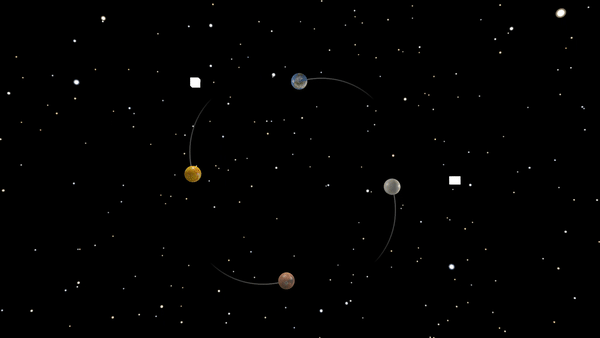

# Three-body Simulator
Author: Zhanyu Guo



## Reference
[learnopengl-cn](https://learnopengl-cn.github.io/)

## Sources
See in `src/*`.

## Build
### Cmake
```bash
sudo apt install cmake build-essential
```

### GLFW
```bash
sudo apt install git
git clone https://github.com/glfw/glfw.git
```

or download from https://www.glfw.org/.

```bash
cd glfw/
sudo apt install libx11-dev libxrandr-dev libxinerama-dev libxcursor-dev libxi-dev
mkdir build
cd build/ && cmake .. && make
sudo make install
```

### OpenGL
```bash
sudo apt install freeglut3-dev libxxf86vm-dev libassimp-dev
```

### Finally
```bash
git clone https://github.com/ZhanyuGuo/three_body_simulator.git
cd three_body_simulator/
mkdir build
cd build/ && cmake .. && make
./three_body_simulator
```

## Update Log of Project
### V1.5
- Add mode selection.

- Add more situations.

- Complete the logic.

### V1.4
- Add light cube for point lights.

- Increase camera's speed.

### V1.3
- Add self-rotation.

### V1.2
- Use low resolution textures to save memory.

- Enable Multisample Anti-aliasing (MSAA).

- Enable Gamma Correction.

### V1.1
- Add diffuse light textures.

- Add specular light textures.

- Use Blinn-Phong instead of Phong.

### V1.0
- Apply a skybox.

- Add light.

### Before V1.0
- From single body to multiple bodies.

- Build a full physical system based on differential equations.

- Generate bodies randomly or specially.

- Visable pure-color bodies and trajectory.

- Build an FPS camera, motion controlled by WASD and view by mouse.
